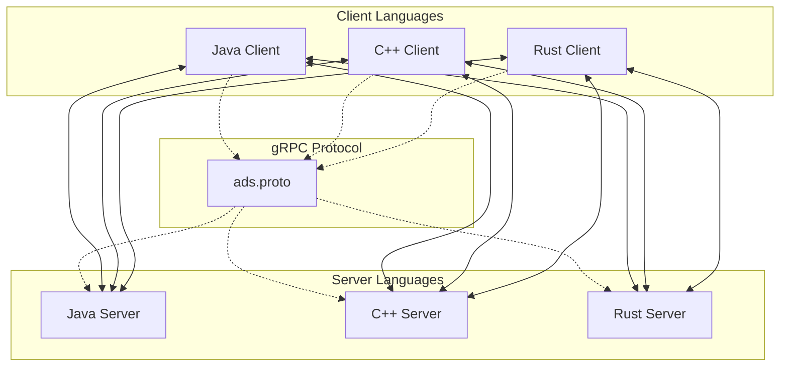
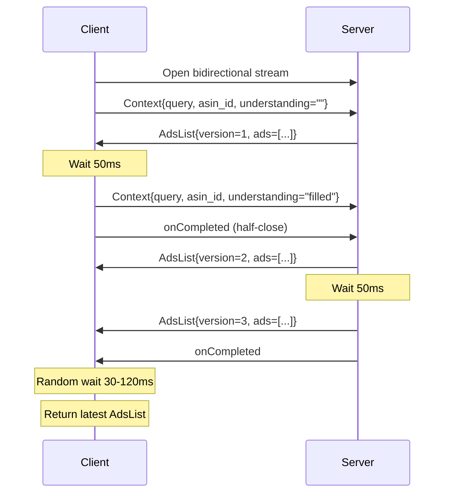

# Design Document

## Overview

The gRPC bidirectional streaming playground implements a real-time ad serving system that demonstrates progressive result refinement through streaming communication. The system consists of clients and servers implemented in Java, C++, and Rust, all communicating through a standardized protobuf protocol. The architecture simulates a realistic scenario where initial ad results are improved as more context becomes available.

## Architecture

### High-Level Architecture



### Communication Flow



## Components and Interfaces

### Protocol Buffer Schema

The core communication protocol is defined in `proto/ads.proto`:

```proto
syntax = "proto3";
package ads;

message Context {
  string query = 1;          // Search query (e.g., "coffee maker")
  string asin_id = 2;        // Product identifier (e.g., "B000123")
  string understanding = 3;  // Refined understanding (empty initially)
}

message Ad {
  string asin_id = 1;        // Product identifier
  string ad_id = 2;          // Advertisement identifier
  double score = 3;          // Relevance score
}

message AdsList {
  repeated Ad ads = 1;       // List of advertisements
  uint32 version = 2;        // Version number (1, 2, 3)
}

service AdsService {
  rpc GetAds(stream Context) returns (stream AdsList);
}
```

### Client Interface

All client implementations must provide:

```
interface AdsClient {
  AdsList getAds(String query, String asinId, String understanding)
  void shutdown()
}
```

Key responsibilities:
- Establish bidirectional stream connection
- Send two Context messages with 50ms delay
- Buffer incoming AdsList messages by version
- Implement random timeout selection (30-120ms)
- Return the latest available AdsList
- Handle graceful shutdown

### Server Interface

All server implementations must provide:

```
interface AdsServer {
  void start(int port)
  void stop()
  AdsList generateAds(Context context, int version)
}
```

Key responsibilities:
- Accept bidirectional stream connections
- Generate mock ads based on context
- Send three AdsList messages with proper timing
- Implement progressive refinement logic
- Handle graceful shutdown

## Data Models

### Context Model
- **query**: User search intent (e.g., "coffee maker")
- **asin_id**: Product context for personalization
- **understanding**: Refined query understanding (empty → filled)

### Ad Model
- **asin_id**: Target product identifier
- **ad_id**: Unique advertisement identifier
- **score**: Relevance score (0.0 - 1.0)

### AdsList Model
- **ads**: Collection of Ad objects (5-10 items)
- **version**: Monotonically increasing version number

### Mock Data Generation Strategy

Servers generate ads using a deterministic algorithm based on:
1. **Base scoring**: Hash of query + asin_id
2. **Understanding boost**: Additional scoring when understanding is provided
3. **Version refinement**: Progressive improvement in scores and relevance
4. **Randomization**: Controlled randomness for realistic variation

## Error Handling

### Client Error Handling
- **Connection failures**: Retry with exponential backoff
- **Stream interruption**: Log error and return partial results if available
- **Timeout handling**: Return best available result within deadline
- **Deserialization errors**: Log and skip malformed messages

### Server Error Handling
- **Invalid context**: Return error status with descriptive message
- **Resource exhaustion**: Implement connection limits and graceful degradation
- **Timing failures**: Ensure cleanup even if scheduled tasks fail
- **Serialization errors**: Log errors and attempt to continue stream

### Cross-Language Compatibility
- **Protobuf version alignment**: Use compatible protobuf versions across languages
- **gRPC version compatibility**: Ensure compatible gRPC library versions
- **Error code mapping**: Standardize error codes across implementations
- **Logging format**: Consistent logging for debugging interop issues

## Testing Strategy

### Unit Testing
- **Protocol buffer serialization/deserialization**
- **Mock ad generation algorithms**
- **Timing logic (delays, timeouts)**
- **Error handling paths**

### Integration Testing
- **Single-language client-server pairs**
- **Message flow verification**
- **Timing constraint validation**
- **Graceful shutdown testing**

### Interoperability Testing
- **All 9 client-server combinations (3x3 matrix)**
- **Message count verification (2 Context, 3 AdsList)**
- **Version ordering validation**
- **Final result selection accuracy**

### Performance Testing
- **Latency measurements for each language**
- **Memory usage profiling**
- **Connection handling under load**
- **Resource cleanup verification**

### Test Automation
- **Build scripts for all languages**
- **Automated test execution**
- **Cross-platform compatibility (Linux, macOS, Windows)**
- **CI/CD integration readiness**